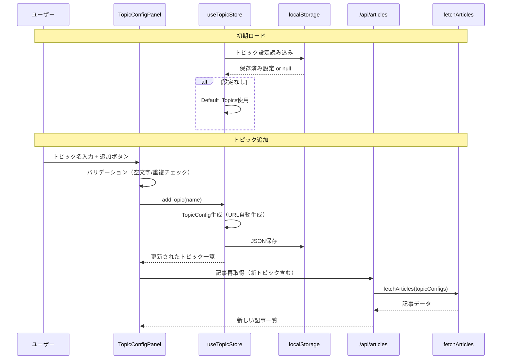

# 設計書: 動的トピック管理

## 概要

動的トピック管理機能は、Zenn Article Dashboardに対してユーザーが自由にトピック（タグ）を追加・削除できる機能を追加する。現在のシステムは環境変数`NEXT_PUBLIC_TOPICS`に固定された4つのトピック（claudecode、skills、mcp、rag）のみに対応しているが、本機能によりブラウザ上からトピックを動的に管理できるようになる。

主な変更点：

- `TopicType`を固定ユニオン型から`string`型に変更し、動的なトピック名を受け入れる
- `useTopicStore`カスタムフックを新規作成し、localStorageでトピック設定を永続化
- `assignTopicColor`動的カラー割り当てモジュールを新規作成し、新しいトピックにも色を自動割り当て
- `TopicConfigPanel`管理UIパネルを新規作成し、トピックの追加・削除を直感的に操作
- `fetchArticles`をクライアントサイドのトピック設定に対応させ、APIエンドポイントをクエリパラメータで動的トピック指定に対応
- トピック設定のJSON シリアライズ・デシリアライズにバリデーション付きラウンドトリップを保証

設計判断の根拠：
- **localStorageベースの永続化**: サーバーサイドDBを不要とし、ユーザーごとの設定をブラウザに保持。既存の`useReadStatus`フックと同じパターンを踏襲
- **string型への変更**: 動的トピックを型安全に扱うため、固定ユニオン型では拡張不可能。`DefaultTopicType`リテラル型を別途定義してデフォルトトピックの識別に使用
- **カラーパレットの循環割り当て**: 無限のトピック追加に対応するため、パレット色を使い切った場合は先頭から再利用

## アーキテクチャ

### システム構成

```mermaid
graph TB
    User[ユーザー]
    Browser[ブラウザ]

    subgraph "Next.js Application"
        Page[Dashboard Page<br/>Server Component]
        API[API Route<br/>/api/articles]

        subgraph "Server Side"
            Fetcher[Article Fetcher<br/>lib/fetchArticles.ts]
            Normalizer[Article Normalizer<br/>lib/normalizeArticle.ts]
            Sorter[Article Sorter<br/>lib/sortArticles.ts]
        end

        subgraph "Client Components"
            DashboardClient[DashboardClient]
            TopicPanel[TopicConfigPanel<br/>新規]
            FilterBar[FilterBar]
            ArticleGrid[ArticleGrid]
        end

        subgraph "Client Hooks & Libs"
            TopicStore[useTopicStore<br/>新規]
            ColorAssigner[assignTopicColor<br/>新規]
            ReadManager[useReadStatus]
        end
    end

    subgraph "External"
        RSS[Zenn RSS Feeds<br/>topics/{name}/feed]
    end

    Storage[(localStorage)]

    User -->|操作| Browser
    Browser -->|初期ロード| Page
    Page -->|SSR| Fetcher
    Fetcher -->|RSS取得| RSS
    Fetcher --> Normalizer --> Sorter

    DashboardClient --> TopicPanel
    DashboardClient --> FilterBar
    DashboardClient --> ArticleGrid

    TopicPanel -->|追加/削除| TopicStore
    TopicStore -->|保存/読取| Storage
    FilterBar -->|色取得| ColorAssigner
    ArticleGrid -->|色取得| ColorAssigner
    TopicPanel -->|色取得| ColorAssigner

    DashboardClient -->|トピック変更時リロード| API
    API -->|クエリパラメータ| Fetcher
```

### データフロー



### レイヤー構造の変更

1. **プレゼンテーション層**（変更）
   - `TopicConfigPanel`: トピック管理UI（新規）
   - `FilterBar`: 動的トピック対応に拡張
   - `ArticleCard`: 動的カラー対応に拡張

2. **状態管理層**（新規）
   - `useTopicStore`: トピック設定のCRUDとlocalStorage永続化

3. **ユーティリティ層**（変更）
   - `assignTopicColor`: 動的カラー割り当て（新規、`TOPIC_COLORS`を置き換え）
   - `topicSerializer`: シリアライズ・デシリアライズ・バリデーション（新規）

4. **データ取得層**（変更）
   - `fetchArticles`: 引数でTopicConfig配列を受け取るように変更
   - API Route: クエリパラメータでトピック設定を受け取るように変更


## コンポーネントとインターフェース

### 型定義の変更

```typescript
// types/article.ts

// デフォルトトピックの識別用リテラル型（要件6.2）
export type DefaultTopicType = 'claudecode' | 'skills' | 'mcp' | 'rag';

// 動的トピック対応のstring型（要件6.1）
export type TopicType = string;

// デフォルトトピック判定ヘルパー
export const DEFAULT_TOPICS: DefaultTopicType[] = ['claudecode', 'skills', 'mcp', 'rag'];
export function isDefaultTopic(topic: string): topic is DefaultTopicType {
  return DEFAULT_TOPICS.includes(topic as DefaultTopicType);
}

// 既存のインターフェースはTopicType変更に伴い自動的に動的対応
export interface ZennArticle {
  id: string;
  title: string;
  link: string;
  pubDate: string;
  author: string;
  topic: TopicType;
  thumbnail: string;
}

export interface TopicConfig {
  name: string;
  url: string;
  type: TopicType;
}

export interface TopicColorConfig {
  badge: string;
  border: string;
  background: string;
}
```

### 新規: useTopicStore フック

```typescript
// hooks/useTopicStore.ts

interface UseTopicStoreReturn {
  /** 現在のトピック設定一覧 */
  topics: TopicConfig[];
  /** トピックを追加する */
  addTopic: (name: string) => { success: boolean; error?: string };
  /** トピックを削除する */
  removeTopic: (type: TopicType) => void;
  /** ローディング状態 */
  isLoading: boolean;
}

export function useTopicStore(): UseTopicStoreReturn
```

責務：
- localStorageからトピック設定を読み込み（要件3.2）
- localStorageが空の場合はDefault_Topicsを初期値として使用（要件3.3）
- トピック追加時にRSSフィードURLを自動生成（要件1.1）
- 重複チェック（要件1.4）
- 空文字列・空白のみのバリデーション（要件1.5）
- トピック名を小文字に正規化（要件6.4）
- 変更を即座にlocalStorageに反映（要件3.5）
- 破損データのフォールバック処理（要件3.4）

### 新規: 動的カラー割り当てモジュール

```typescript
// lib/topicColors.ts（既存ファイルを拡張）

// デフォルトトピックの固定カラー（要件4.1）
const DEFAULT_TOPIC_COLORS: Record<DefaultTopicType, TopicColorConfig> = {
  claudecode: { badge: 'bg-purple-100 text-purple-800', border: 'border-purple-200', background: 'hover:bg-purple-50' },
  skills:     { badge: 'bg-yellow-100 text-yellow-800', border: 'border-yellow-200', background: 'hover:bg-yellow-50' },
  mcp:        { badge: 'bg-blue-100 text-blue-800',     border: 'border-blue-200',   background: 'hover:bg-blue-50' },
  rag:        { badge: 'bg-green-100 text-green-800',   border: 'border-green-200',  background: 'hover:bg-green-50' },
};

// 動的トピック用カラーパレット（要件4.2）
const DYNAMIC_COLOR_PALETTE: TopicColorConfig[] = [
  { badge: 'bg-red-100 text-red-800',    border: 'border-red-200',    background: 'hover:bg-red-50' },
  { badge: 'bg-pink-100 text-pink-800',  border: 'border-pink-200',   background: 'hover:bg-pink-50' },
  { badge: 'bg-indigo-100 text-indigo-800', border: 'border-indigo-200', background: 'hover:bg-indigo-50' },
  { badge: 'bg-teal-100 text-teal-800',  border: 'border-teal-200',   background: 'hover:bg-teal-50' },
  { badge: 'bg-orange-100 text-orange-800', border: 'border-orange-200', background: 'hover:bg-orange-50' },
  { badge: 'bg-cyan-100 text-cyan-800',  border: 'border-cyan-200',   background: 'hover:bg-cyan-50' },
];

/**
 * トピックに対応するカラー設定を返す（要件4.3, 4.5）
 * デフォルトトピックは固定色、動的トピックはパレットから決定的に割り当て
 */
export function getTopicColor(topic: TopicType, allTopics: TopicType[]): TopicColorConfig

/**
 * 後方互換性のためのTOPIC_COLORSプロキシ
 */
export function getTopicColors(allTopics: TopicType[]): Record<string, TopicColorConfig>
```

カラー割り当てアルゴリズム：
1. デフォルトトピック → 固定カラーマッピングから返す
2. 動的トピック → 動的トピックのみをソートし、インデックスを`DYNAMIC_COLOR_PALETTE.length`で剰余を取ってパレットから割り当て（要件4.4, 4.5）

### 新規: トピック設定シリアライザ

```typescript
// lib/topicSerializer.ts

const STORAGE_KEY = 'zenn-dashboard-topics';

/** TopicConfig配列をJSON文字列にシリアライズ（要件9.1） */
export function serializeTopics(topics: TopicConfig[]): string

/** JSON文字列をTopicConfig配列にデシリアライズ（要件9.2） */
export function deserializeTopics(json: string): TopicConfig[] | null

/** TopicConfig配列のバリデーション（要件9.4） */
export function validateTopicConfigs(data: unknown): data is TopicConfig[]
```

### 新規: TopicConfigPanel コンポーネント

```typescript
// components/TopicConfigPanel.tsx

interface TopicConfigPanelProps {
  topics: TopicConfig[];
  onAddTopic: (name: string) => { success: boolean; error?: string };
  onRemoveTopic: (type: TopicType) => void;
  allTopicTypes: TopicType[];
}

export function TopicConfigPanel(props: TopicConfigPanelProps)
```

責務：
- トピック名入力フィールドと追加ボタンの表示（要件1.6, 7.1）
- 現在のトピック一覧のリスト表示（要件7.2）
- 各トピックにカラーバッジを表示（要件7.3）
- デフォルトトピックに「デフォルト」ラベルを表示（要件7.4）
- プレースホルダーテキスト表示（要件7.5）
- aria属性の設定（要件7.6）
- 各トピックに削除ボタンを表示（要件2.5）
- エラーメッセージの表示（要件1.4, 1.5）

### 変更: DashboardClient コンポーネント

```typescript
// components/DashboardClient.tsx（変更）

interface DashboardClientProps {
  initialArticles: ZennArticle[];
}

export function DashboardClient({ initialArticles }: DashboardClientProps)
```

変更点：
- `useTopicStore`フックを統合
- トピック変更時にAPIから記事を再取得
- `TopicConfigPanel`を配置
- フィルタリングを動的トピック一覧に基づいて実行

### 変更: FilterBar コンポーネント

```typescript
// components/FilterBar.tsx（変更）

interface FilterBarProps {
  topics: TopicType[];
  selectedTopics: TopicType[];
  onFilterChange: (topics: TopicType[]) => void;
  allTopicTypes: TopicType[]; // カラー割り当て用
}
```

変更点：
- 固定の`topicLabels`マッピングを廃止し、トピック名をそのままラベルとして使用（要件5.5）
- `getTopicColor`を使用して動的カラーを取得（要件5.3）

### 変更: API Route

```typescript
// app/api/articles/route.ts（変更）

// クエリパラメータでトピック設定を受け取る
export async function GET(request: Request): Promise<Response>
// ?topics=JSON形式のTopicConfig配列
```

変更点：
- クエリパラメータ`topics`からTopicConfig配列を受け取る
- 環境変数のトピック設定とマージ（要件8.2）
- 動的トピックのRSSフィードURLを生成（要件8.4）

### 変更: fetchArticles

```typescript
// lib/fetchArticles.ts（変更）

// TopicConfig配列を引数で受け取るオーバーロードを追加
export async function fetchArticles(
  topicConfigs?: TopicConfig[]
): Promise<FetchArticlesResult>
```

変更点：
- 引数が渡された場合はそれを使用、なければ環境変数から読み取り
- `isValidTopicConfig`のTopicType検証を緩和（string型を受け入れ）（要件6.3）


## データモデル

### TopicConfig（変更なし、型のみ拡張）

```typescript
{
  name: string;        // トピック表示名（例: "Next.js"）
  url: string;         // RSSフィードURL（例: "https://zenn.dev/topics/nextjs/feed"）
  type: TopicType;     // トピックタイプ（小文字正規化済み、例: "nextjs"）
}
```

### localStorage Schema: トピック設定

```typescript
// キー: "zenn-dashboard-topics"
// 値: JSON文字列化されたTopicConfig配列
TopicConfig[]

// 例:
[
  { "name": "Claude Code", "url": "https://zenn.dev/topics/claudecode/feed", "type": "claudecode" },
  { "name": "Skills",      "url": "https://zenn.dev/topics/skills/feed",     "type": "skills" },
  { "name": "MCP",         "url": "https://zenn.dev/topics/mcp/feed",        "type": "mcp" },
  { "name": "RAG",         "url": "https://zenn.dev/topics/rag/feed",        "type": "rag" },
  { "name": "nextjs",      "url": "https://zenn.dev/topics/nextjs/feed",     "type": "nextjs" }
]
```

### デフォルトトピック設定

環境変数`NEXT_PUBLIC_TOPICS`から読み込まれる初期トピック。localStorageに設定が存在しない場合のフォールバック値として使用。

```typescript
const DEFAULT_TOPIC_CONFIGS: TopicConfig[] = [
  { name: 'Claude Code', url: 'https://zenn.dev/topics/claudecode/feed', type: 'claudecode' },
  { name: 'Skills',      url: 'https://zenn.dev/topics/skills/feed',     type: 'skills' },
  { name: 'MCP',         url: 'https://zenn.dev/topics/mcp/feed',        type: 'mcp' },
  { name: 'RAG',         url: 'https://zenn.dev/topics/rag/feed',        type: 'rag' },
];
```

### カラーパレット構造

```typescript
// デフォルトトピック: 固定カラー
// claudecode → 紫, skills → 黄, mcp → 青, rag → 緑

// 動的トピック: パレットから循環割り当て
// index 0 → 赤, 1 → ピンク, 2 → インディゴ, 3 → ティール, 4 → オレンジ, 5 → シアン
// index 6 → 赤（循環）, ...
```

### RSSフィードURL生成規則

動的に追加されたトピックのRSSフィードURLは以下の形式で生成：

```
https://zenn.dev/topics/{topic_name}/feed
```

`topic_name`はユーザー入力を小文字に正規化した値。


## Correctness Properties

*プロパティとは、システムのすべての有効な実行において真であるべき特性や動作のことです。本質的には、システムが何をすべきかについての形式的な記述です。プロパティは、人間が読める仕様と機械で検証可能な正確性の保証との橋渡しとなります。*

### Property 1: RSSフィードURL生成の正確性

*任意の*有効なトピック名（空でない、空白のみでない文字列）に対して、生成されるRSSフィードURLは`https://zenn.dev/topics/{小文字正規化されたトピック名}/feed`の形式でなければならない

**Validates: Requirements 1.1, 8.4**

### Property 2: トピック追加による一覧の成長

*任意の*トピック一覧と有効な（重複しない、空でない）トピック名に対して、トピックを追加すると一覧の長さが1増加し、追加されたトピックが一覧に含まれなければならない

**Validates: Requirements 1.1, 1.2**

### Property 3: 重複トピックの拒否

*任意の*トピック一覧に対して、既に存在するトピック名を追加しようとした場合、追加は拒否され、トピック一覧は変更されてはならない

**Validates: Requirements 1.4**

### Property 4: 空白トピック名の拒否

*任意の*空白文字のみで構成される文字列に対して、トピック追加は拒否され、トピック一覧は変更されてはならない

**Validates: Requirements 1.5**

### Property 5: トピック削除による一覧の縮小

*任意の*トピック一覧と一覧内の任意のトピックに対して、そのトピックを削除すると一覧の長さが1減少し、削除されたトピックが一覧に含まれてはならない

**Validates: Requirements 2.1, 2.2**

### Property 6: トピック設定のシリアライズ・デシリアライズ ラウンドトリップ

*任意の*有効なTopicConfig配列に対して、シリアライズしてからデシリアライズした結果は元のTopicConfig配列と等価でなければならない

**Validates: Requirements 9.1, 9.2, 9.3, 3.1, 3.2, 3.5**

### Property 7: 不正データに対するフォールバック

*任意の*有効なTopicConfig配列でないJSON文字列に対して、デシリアライズを試みた場合、バリデーションエラーとして処理され、Default_Topicsにフォールバックしなければならない

**Validates: Requirements 3.4, 9.4**

### Property 8: デフォルトトピックの固定カラー維持

*任意の*トピック一覧（デフォルトトピックを含む）に対して、デフォルトトピック（claudecode、skills、mcp、rag）のカラー設定は常に固定値（紫、黄、青、緑）でなければならない

**Validates: Requirements 4.1, 4.5**

### Property 9: 動的カラー割り当ての決定性

*任意の*トピック一覧と任意のトピック名に対して、`getTopicColor`を複数回呼び出した結果は常に同一のTopicColorConfig（badge、border、backgroundの3フィールドを含む）を返さなければならない

**Validates: Requirements 4.2, 4.3, 4.5**

### Property 10: カラーパレットの循環割り当て

*任意の*パレットサイズを超える数の動的トピックに対して、カラー割り当てはパレットの先頭から循環して再利用されなければならない

**Validates: Requirements 4.4**

### Property 11: フィルタリングの正確性

*任意の*記事一覧と選択されたトピックセットに対して、フィルタリングを適用すると、返される記事はすべて選択されたトピックのいずれかに一致しなければならない

**Validates: Requirements 5.4, 2.3, 2.4**

### Property 12: トピック一覧の完全表示

*任意の*トピック設定一覧に対して、FilterBarおよびTopicConfigPanelに渡されるトピック一覧は、設定されたすべてのトピックを含まなければならない

**Validates: Requirements 5.1, 5.2, 5.5, 7.2**

### Property 13: トピック名の小文字正規化

*任意の*文字列に対して、トピック名の正規化処理を適用すると、結果は元の文字列の小文字版と等しくなければならない

**Validates: Requirements 6.4**

### Property 14: デフォルトトピック判定の正確性

*任意の*文字列に対して、`isDefaultTopic`関数は、その文字列がデフォルトトピック一覧（claudecode、skills、mcp、rag）に含まれる場合のみtrueを返さなければならない

**Validates: Requirements 6.2**

### Property 15: トピック設定マージの完全性

*任意の*環境変数由来のTopicConfig配列とlocalStorage由来のTopicConfig配列に対して、マージ結果は両方の配列のすべてのトピックを含み、重複するtypeのトピックはlocalStorage側が優先されなければならない

**Validates: Requirements 8.2**


## エラーハンドリング

### トピック追加バリデーションエラー

エラーシナリオ：
- 空文字列または空白のみのトピック名
- 既に存在するトピック名の重複入力

処理方法：
```typescript
function addTopic(name: string): { success: boolean; error?: string } {
  const normalized = name.trim().toLowerCase();
  if (!normalized) {
    return { success: false, error: 'トピック名を入力してください' };
  }
  if (topics.some(t => t.type === normalized)) {
    return { success: false, error: 'このトピックは既に追加されています' };
  }
  // TopicConfig生成と保存...
  return { success: true };
}
```

### localStorage読み込みエラー

エラーシナリオ：
- localStorageが利用不可（プライベートモード等）
- 保存データが破損したJSON
- デシリアライズ結果が有効なTopicConfig配列でない

処理方法：
```typescript
function loadTopics(): TopicConfig[] {
  try {
    const stored = localStorage.getItem(STORAGE_KEY);
    if (!stored) return getDefaultTopics();
    
    const parsed = deserializeTopics(stored);
    if (!parsed) {
      console.warn('Invalid topic data in localStorage, falling back to defaults');
      return getDefaultTopics();
    }
    return parsed;
  } catch (error) {
    console.warn('Failed to load topics from localStorage:', error);
    return getDefaultTopics();
  }
}
```

### localStorage書き込みエラー

エラーシナリオ：
- クォータ超過
- セキュリティ制限

処理方法：
```typescript
function saveTopics(topics: TopicConfig[]): void {
  try {
    localStorage.setItem(STORAGE_KEY, serializeTopics(topics));
  } catch (error) {
    console.error('Failed to save topics to localStorage:', error);
    // UIにはエラーを表示しない（次回保存時にリトライ）
  }
}
```

### RSSフィード取得エラー（動的トピック）

エラーシナリオ：
- 存在しないトピック名のRSSフィード
- ネットワークエラー
- 無効なRSS形式

処理方法：
- 既存の`fetchArticles`のエラーハンドリングを踏襲
- 失敗したフィードをスキップし、他のフィードの取得を継続
- エラーをerrorsリストに記録してUIに表示

### APIエンドポイントエラー（動的トピック）

エラーシナリオ：
- 不正なクエリパラメータ
- TopicConfig配列のバリデーション失敗

処理方法：
```typescript
export async function GET(request: Request): Promise<Response> {
  const url = new URL(request.url);
  const topicsParam = url.searchParams.get('topics');
  
  let topicConfigs: TopicConfig[] | undefined;
  if (topicsParam) {
    try {
      const parsed = JSON.parse(topicsParam);
      if (!validateTopicConfigs(parsed)) {
        return Response.json({ error: 'Invalid topics parameter' }, { status: 400 });
      }
      topicConfigs = parsed;
    } catch {
      return Response.json({ error: 'Invalid JSON in topics parameter' }, { status: 400 });
    }
  }
  // fetchArticles呼び出し...
}
```

## テスト戦略

### デュアルテストアプローチ

本機能では、ユニットテストとプロパティベーステストの両方を使用する：

- **ユニットテスト**: 特定の例、エッジケース、エラー条件を検証
- **プロパティベーステスト**: すべての入力にわたる普遍的なプロパティを検証

両者は補完的であり、包括的なカバレッジに必要。ユニットテストは具体的なバグを捕捉し、プロパティテストは一般的な正確性を検証する。

### プロパティベーステスト設定

**使用ライブラリ**: fast-check（既にプロジェクトにインストール済み）

**設定要件**:
- 各プロパティテストは最低100回の反復を実行
- 各テストは設計書のプロパティを参照するコメントタグを含む
- タグ形式: `// Feature: dynamic-topic-management, Property {number}: {property_text}`
- 各Correctness Propertyは1つのプロパティベーステストで実装する

### ユニットテストの焦点

1. **特定の例**:
   - デフォルトトピック4つの固定カラー確認（4.1）
   - TopicConfigPanelの入力フィールドと追加ボタンの存在（1.6）
   - 各トピックの削除ボタンの存在（2.5）
   - デフォルトトピックの「デフォルト」ラベル表示（7.4）
   - プレースホルダーテキストの表示（7.5）
   - aria属性の設定（7.6）
   - RSSフィード取得失敗時の継続動作（8.3）
   - 動的TopicConfigのfetchArticles受け入れ（6.3）
   - Dashboard初期ロード時のトピック読み込み（8.1）

2. **エッジケース**:
   - localStorageが空の場合のDefault_Topicsフォールバック（3.3）
   - パレットサイズちょうどのトピック数
   - 1文字のトピック名
   - 日本語を含むトピック名

3. **エラー条件**:
   - 破損したlocalStorageデータ
   - localStorage利用不可
   - 不正なAPIクエリパラメータ
   - 存在しないトピックのRSSフィード取得失敗

### テストファイル構成

```
lib/__tests__/
├── topicColors.test.ts              # カラー割り当てユニットテスト
├── topicColors.property.test.ts     # カラー割り当てプロパティテスト（Property 8, 9, 10）
├── topicSerializer.test.ts          # シリアライザユニットテスト
├── topicSerializer.property.test.ts # シリアライザプロパティテスト（Property 6, 7）
├── fetchArticles.test.ts            # 既存テスト拡張
hooks/__tests__/
├── useTopicStore.test.ts            # トピックストアユニットテスト
├── useTopicStore.property.test.ts   # トピックストアプロパティテスト（Property 2, 3, 4, 5, 13）
components/__tests__/
├── TopicConfigPanel.test.tsx        # UIコンポーネントテスト
├── FilterBar.test.tsx               # 既存テスト拡張
├── FilterBar.property.test.tsx      # フィルタリングプロパティテスト（Property 11, 12）
app/api/__tests__/
├── articles.test.ts                 # APIエンドポイントテスト拡張
```

### プロパティテストのジェネレータ例

```typescript
import fc from 'fast-check';
import { TopicConfig } from '@/types/article';

// 有効なトピック名ジェネレータ
const validTopicName = fc.stringOf(
  fc.constantFrom(...'abcdefghijklmnopqrstuvwxyz0123456789-'.split('')),
  { minLength: 1, maxLength: 30 }
);

// 有効なTopicConfigジェネレータ
const validTopicConfig = validTopicName.map(name => ({
  name,
  url: `https://zenn.dev/topics/${name}/feed`,
  type: name,
}));

// 有効なTopicConfig配列ジェネレータ（重複なし）
const validTopicConfigArray = fc.uniqueArray(validTopicConfig, {
  comparator: (a, b) => a.type === b.type,
  minLength: 0,
  maxLength: 20,
});
```

