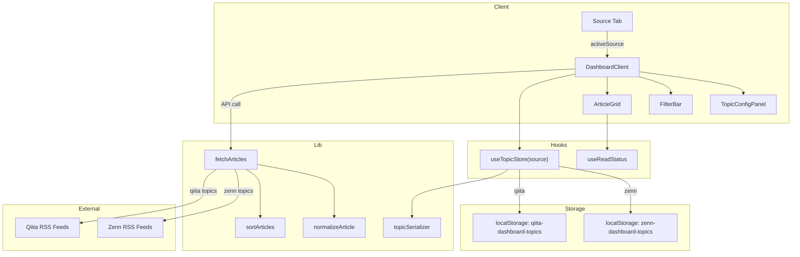

# 設計書: Qiita RSS Integration

## 概要

既存のZenn RSSダッシュボードにQiita RSSフィード取得機能を追加する。ユーザーはソースタブ（Zenn / Qiita）を切り替えて記事を閲覧でき、各ソースごとに独立したトピック管理を行える。

主な設計方針:
- **既存コードへの影響最小化**: 既存の型・コンポーネント・フックを拡張する形で実装し、破壊的変更を避ける
- **ソース別分離**: トピック設定・localStorage永続化・記事取得をソース単位で分離する
- **共通ロジックの再利用**: `normalizeArticle`、`sortArticles`、`fetchArticles`などの既存ロジックはそのまま活用する
- **後方互換性**: `source`フィールドが無い既存データは`'zenn'`として扱う

### 技術スタック（既存）
- Next.js (App Router) + React 19
- rss-parser (RSS解析)
- date-fns (日付処理)
- Tailwind CSS (スタイリング)
- Jest + fast-check (テスト)
- localStorage (クライアント永続化)

## アーキテクチャ

### 全体構成



### データフロー

1. `DashboardClient`が`activeSource`状態を管理
2. `SourceTab`でユーザーがタブを切り替えると`activeSource`が変更される
3. `useTopicStore`は`activeSource`に応じたlocalStorageキーからトピックを読み込む
4. トピック変更時に`/api/articles`エンドポイントへリクエスト
5. APIは`fetchArticles`を呼び出し、各トピックのRSSフィードを取得・正規化・ソート
6. 結果がクライアントに返され、`ArticleGrid`で表示

## コンポーネントとインターフェース

### 新規コンポーネント

#### SourceTab

ソース切り替えタブUIコンポーネント。

```typescript
// components/SourceTab.tsx
interface SourceTabProps {
  activeSource: ArticleSource;
  onSourceChange: (source: ArticleSource) => void;
}
```

- "Zenn"と"Qiita"の2つのタブを表示
- アクティブタブを視覚的に強調（Tailwind CSSのborder-bottom + テキスト色変更）
- タブ切り替え時に`onSourceChange`コールバックを呼び出す

### 既存コンポーネントの変更

#### DashboardClient

```typescript
// 変更点: activeSource状態の追加、SourceTabの統合
interface DashboardClientProps {
  initialArticles: ZennArticle[];  // 変更なし（初回はZennの記事）
}

// 内部状態の追加:
// - activeSource: ArticleSource（デフォルト: 'zenn'）
// - ソース切り替え時にuseTopicStoreのソースを切り替え
// - ソース切り替え時に記事を再取得
```

#### TopicConfigPanel

変更なし。既存のインターフェースで動作する。`useTopicStore`がソース別のURL生成を担当するため、パネル自体はソースを意識しない。

#### FilterBar

変更なし。`topics`プロパティに渡されるトピック一覧がソース別になるだけで、コンポーネント自体の変更は不要。

### フックの変更

#### useTopicStore

```typescript
// hooks/useTopicStore.ts - リファクタリング
interface UseTopicStoreReturn {
  topics: TopicConfig[];
  addTopic: (name: string) => { success: boolean; error?: string };
  removeTopic: (type: TopicType) => void;
  isLoading: boolean;
}

// 引数にsourceを追加
function useTopicStore(source: ArticleSource): UseTopicStoreReturn;
```

主な変更:
- `source`引数を受け取り、ソース別のlocalStorageキーを使用
- `addTopic`でソースに応じたURL生成パターンを適用
  - Zenn: `https://zenn.dev/topics/{name}/feed`
  - Qiita: `https://qiita.com/tags/{name}/feed`
- デフォルトトピックをソース別に定義
- `source`変更時にlocalStorageから再読み込み

### ライブラリの変更

#### topicSerializer

```typescript
// lib/topicSerializer.ts - ソース別キー対応
function getStorageKey(source: ArticleSource): string;
// 'zenn' → 'zenn-dashboard-topics'（既存キー、後方互換）
// 'qiita' → 'qiita-dashboard-topics'
```

既存の`serializeTopics`、`deserializeTopics`、`validateTopicConfigs`は変更なし。

#### normalizeArticle

変更なし。既にTopicTypeを引数で受け取る汎用的な設計のため、Qiita RSSアイテムもそのまま正規化可能。

#### fetchArticles

変更なし。既にTopicConfig配列を引数で受け取り、各トピックのURLからRSSを取得する汎用的な設計。TopicConfigにsourceフィールドが追加されても、URLベースで取得するため影響なし。

### APIエンドポイント

#### GET /api/articles

変更点:
- `validateTopicConfigs`がsourceフィールドを含むTopicConfigを受け入れるよう更新
- sourceフィールドが無い場合は`'zenn'`をデフォルトとして扱う（後方互換）

## データモデル

### 型定義の変更

```typescript
// types/article.ts に追加

/** ソース種別 */
export type ArticleSource = 'zenn' | 'qiita';

/** TopicConfigにsourceフィールドを追加 */
export interface TopicConfig {
  name: string;
  url: string;
  type: TopicType;
  source?: ArticleSource;  // オプショナル（後方互換性）
}
```

### デフォルトトピック定義

```typescript
// Zennデフォルトトピック（既存）
const ZENN_DEFAULT_TOPICS: TopicConfig[] = [
  { name: 'Claude Code', url: 'https://zenn.dev/topics/claudecode/feed', type: 'claudecode', source: 'zenn' },
  { name: 'Skills', url: 'https://zenn.dev/topics/skills/feed', type: 'skills', source: 'zenn' },
  { name: 'MCP', url: 'https://zenn.dev/topics/mcp/feed', type: 'mcp', source: 'zenn' },
  { name: 'RAG', url: 'https://zenn.dev/topics/rag/feed', type: 'rag', source: 'zenn' },
];

// Qiitaデフォルトトピック（新規）
const QIITA_DEFAULT_TOPICS: TopicConfig[] = [
  { name: 'RAG', url: 'https://qiita.com/tags/rag/feed', type: 'rag', source: 'qiita' },
  { name: 'MCP', url: 'https://qiita.com/tags/mcp/feed', type: 'mcp', source: 'qiita' },
  { name: 'AgentSkills', url: 'https://qiita.com/tags/agentskills/feed', type: 'agentskills', source: 'qiita' },
  { name: 'Claude Code', url: 'https://qiita.com/tags/claudecode/feed', type: 'claudecode', source: 'qiita' },
];
```

### localStorage キー戦略

| ソース | キー | 備考 |
|--------|------|------|
| Zenn | `zenn-dashboard-topics` | 既存キーを維持（後方互換） |
| Qiita | `qiita-dashboard-topics` | 新規キー |

### 後方互換性

- 既存の`zenn-dashboard-topics`キーのデータは`source`フィールドが無い可能性がある
- `deserializeTopics`でデータ読み込み時、`source`が無いTopicConfigには`'zenn'`をデフォルト設定
- APIエンドポイントでも同様に`source`未指定時は`'zenn'`として扱う


## 正当性プロパティ (Correctness Properties)

*プロパティとは、システムのすべての有効な実行において真であるべき特性や振る舞いのことです。人間が読める仕様と機械的に検証可能な正当性保証の橋渡しとなる形式的な記述です。*

### Property 1: ソース別URL生成パターン

*For any* トピック名（非空文字列）とソース種別において、Zennソースの場合は `https://zenn.dev/topics/{name}/feed` パターン、Qiitaソースの場合は `https://qiita.com/tags/{name}/feed` パターンのURLが生成されること。

**Validates: Requirements 2.1, 2.2, 5.2, 5.3**

### Property 2: ソース別トピック分離

*For any* ソース（ZennまたはQiita）へのトピック追加・削除操作において、もう一方のソースのlocalStorageに保存されたトピック一覧が変更されないこと。

**Validates: Requirements 3.6, 5.1, 5.4, 5.5, 7.2, 7.3**

### Property 3: 後方互換性デフォルト

*For any* `source`フィールドを持たないTopicConfigオブジェクトにおいて、デシリアライズ後のsourceは`'zenn'`にデフォルト設定されること。

**Validates: Requirements 1.3, 8.3**

### Property 4: トピック重複検出

*For any* 既にソース内に存在するトピック名を再度追加しようとした場合、追加は拒否されエラーが返されること。また、トピック一覧は変更されないこと。

**Validates: Requirements 5.6**

### Property 5: トピック永続化ラウンドトリップ

*For any* 有効なTopicConfig配列において、localStorageへのシリアライズ後にデシリアライズすると、元と同等のTopicConfig配列が復元されること。

**Validates: Requirements 7.4**

### Property 6: 破損データのフォールバック分離

*For any* ソースのlocalStorageデータが破損している場合、そのソースはデフォルトトピックにフォールバックし、もう一方のソースの正常なデータには影響しないこと。

**Validates: Requirements 7.5**

### Property 7: ArticleSource型バリデーション

*For any* 文字列において、`'zenn'`と`'qiita'`のみがArticleSourceとして有効であり、それ以外の文字列はバリデーションで拒否されること。

**Validates: Requirements 1.1, 8.2**

### Property 8: 記事リンク重複排除

*For any* 同一リンクを持つ記事が複数含まれる記事リストにおいて、fetchArticlesの出力には各リンクが最大1回しか出現しないこと。

**Validates: Requirements 2.5**

### Property 9: ソース別記事表示

*For any* アクティブソースとトピック設定において、表示される記事はアクティブソースのトピックから取得されたもののみであること。

**Validates: Requirements 6.1, 6.2, 6.4**

### Property 10: タブ切り替え時の状態保持

*For any* タブ切り替え操作の列において、各ソースのトピック設定とフィルタ状態は、タブを離れて戻った後も保持されていること。

**Validates: Requirements 4.5**

## エラーハンドリング

### RSSフィード取得エラー

| エラー種別 | 対応 | 要件 |
|-----------|------|------|
| Qiita RSSフィード取得失敗 | エラーをログに記録し、他のフィードの取得を継続。エラー情報をUIに表示 | 2.3 |
| ネットワークタイムアウト | 既存のrss-parserのタイムアウト処理に委譲 | - |

### localStorage エラー

| エラー種別 | 対応 | 要件 |
|-----------|------|------|
| データ破損（パース失敗） | 該当ソースのみデフォルトトピックにフォールバック。他ソースは影響なし | 7.5 |
| localStorage容量超過 | `console.error`でログ出力。メモリ上の状態は維持 | - |
| localStorage未対応環境 | デフォルトトピックで動作。永続化は無効 | - |

### バリデーションエラー

| エラー種別 | 対応 | 要件 |
|-----------|------|------|
| 空のトピック名 | エラーメッセージ表示、追加を拒否 | 5.6 |
| 重複トピック追加 | エラーメッセージ表示、追加を拒否 | 5.6 |
| 無効なsource値（API） | 400エラーレスポンス | 8.2 |
| sourceフィールド欠落（API） | `'zenn'`をデフォルト設定して処理続行 | 8.3 |

## テスト戦略

### テストアプローチ

ユニットテストとプロパティベーステストの二本立てで網羅的なカバレッジを実現する。

- **ユニットテスト**: 具体的な例、エッジケース、エラー条件の検証
- **プロパティベーステスト**: ランダム入力による普遍的プロパティの検証

### テストライブラリ

- **Jest**: テストランナー・アサーション（既存）
- **fast-check**: プロパティベーステスト（既存、package.jsonに含まれる）
- **@testing-library/react**: コンポーネントテスト（既存）

### プロパティベーステスト設定

- 各プロパティテストは最低100回のイテレーションで実行
- 各テストにはデザインドキュメントのプロパティ番号を参照するコメントタグを付与
- タグフォーマット: `Feature: qiita-rss-integration, Property {number}: {property_text}`
- 各正当性プロパティは1つのプロパティベーステストで実装

### ユニットテスト対象

| テスト対象 | テスト内容 | 対応要件 |
|-----------|-----------|---------|
| SourceTab | 初期表示でZennタブがアクティブ | 4.1, 4.2 |
| SourceTab | タブクリックでonSourceChangeが呼ばれる | 4.3 |
| Qiitaデフォルトトピック | 4つのデフォルトトピックが正しいURL・名前で定義されている | 3.1-3.5 |
| TopicConfigPanel | Zenn/Qiita両方で同じUIが表示される | 5.7 |
| API endpoint | sourceフィールド付きTopicConfigを受け入れる | 8.1 |
| fetchArticles | Qiita RSSフィード取得失敗時に他フィードの取得を継続 | 2.3 |
| DashboardClient | タブ切り替え時に記事を再取得 | 6.3 |

### プロパティベーステスト対象

| Property | テスト内容 | ジェネレータ |
|----------|-----------|------------|
| Property 1 | ソース別URL生成パターン | ランダムトピック名 × ソース種別 |
| Property 2 | ソース別トピック分離 | ランダムトピック操作列 × ソース |
| Property 3 | 後方互換性デフォルト | sourceフィールド無しのランダムTopicConfig |
| Property 4 | トピック重複検出 | ランダムトピック名（既存リストに含まれるもの） |
| Property 5 | トピック永続化ラウンドトリップ | ランダムTopicConfig配列 |
| Property 6 | 破損データのフォールバック分離 | ランダム破損文字列 × 正常TopicConfig |
| Property 7 | ArticleSource型バリデーション | ランダム文字列 |
| Property 8 | 記事リンク重複排除 | 重複リンクを含むランダム記事リスト |
| Property 9 | ソース別記事表示 | ランダムソース × ランダムトピック設定 |
| Property 10 | タブ切り替え時の状態保持 | ランダムタブ切り替え操作列 |
