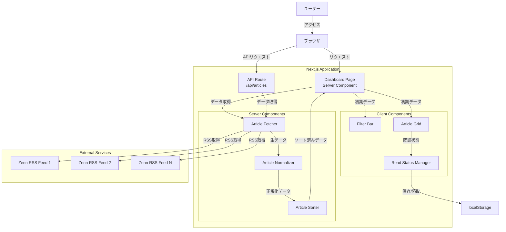

# 設計書

## 概要

Zenn Article Dashboardは、Next.js App Routerを使用したサーバーサイドレンダリング（SSR）アプリケーションです。複数のZenn RSSフィードから記事を取得し、トピック別に整理して表示します。

システムは以下の主要な特徴を持ちます：

- Server Componentsによる高速な初期表示
- トピック別カラーコーディングによる視覚的な識別
- クライアントサイドのフィルタリングとインタラクション
- localStorageを使用した既読状態の永続化
- レスポンシブなグリッドレイアウト

技術スタック：
- Next.js 14+ (App Router)
- TypeScript
- Tailwind CSS
- rss-parser
- date-fns

## アーキテクチャ

### システム構成



### レイヤー構造

1. **プレゼンテーション層**
   - Server Components: 初期データ取得とSSR
   - Client Components: インタラクティブなUI

2. **データ取得層**
   - RSS Feed Fetcher: 外部RSSフィードからのデータ取得
   - API Routes: クライアントサイドからのデータアクセス

3. **データ処理層**
   - Normalizer: データ変換と正規化
   - Sorter: データソート

4. **永続化層**
   - localStorage: クライアントサイドの既読状態管理

## コンポーネントとインターフェース

### 型定義

```typescript
// types/article.ts

export type TopicType = 'claudecode' | 'skills' | 'mcp' | 'rag';

export interface ZennArticle {
  id: string;
  title: string;
  link: string;
  pubDate: string; // ISO 8601形式
  author: string;
  topic: TopicType;
  thumbnail: string;
}

export interface TopicConfig {
  name: string;
  url: string;
  type: TopicType;
}

export interface TopicColorConfig {
  badge: string;
  border: string;
  background: string;
}
```

### サーバーコンポーネント

#### Article Fetcher

```typescript
// lib/fetchArticles.ts

interface FetchArticlesResult {
  articles: ZennArticle[];
  errors: Array<{ topic: string; error: string }>;
}

async function fetchArticles(): Promise<FetchArticlesResult>
```

責務：
- 環境変数からトピック設定を読み取る
- 各RSSフィードからデータを取得
- エラーハンドリングとログ記録
- 正規化とソートの呼び出し

#### Article Normalizer

```typescript
// lib/normalizeArticle.ts

function normalizeArticle(
  item: Parser.Item,
  topic: TopicType
): ZennArticle
```

責務：
- RSSアイテムをZennArticle形式に変換
- 必須フィールドの検証とデフォルト値の設定
- 日付のISO 8601形式への変換
- 一意なIDの生成

#### Article Sorter

```typescript
// lib/sortArticles.ts

function sortArticlesByDate(articles: ZennArticle[]): ZennArticle[]
```

責務：
- 記事を公開日時の降順でソート
- date-fnsを使用した日付比較
- 安定ソートの保証

### クライアントコンポーネント

#### Dashboard Page

```typescript
// app/page.tsx

export default async function DashboardPage()
```

責務：
- 初期データの取得（Server Component）
- クライアントコンポーネントへのデータ渡し
- エラー境界の設定

#### Filter Bar

```typescript
// components/FilterBar.tsx

interface FilterBarProps {
  topics: TopicType[];
  selectedTopics: TopicType[];
  onFilterChange: (topics: TopicType[]) => void;
}

export function FilterBar(props: FilterBarProps)
```

責務：
- トピックフィルタの表示
- 複数選択の管理
- アクティブフィルタの視覚的表示

#### Article Grid

```typescript
// components/ArticleGrid.tsx

interface ArticleGridProps {
  articles: ZennArticle[];
  readArticles: Set<string>;
  onArticleClick: (articleId: string) => void;
}

export function ArticleGrid(props: ArticleGridProps)
```

責務：
- レスポンシブグリッドレイアウト
- 記事カードの表示
- トピック別カラーコーディング
- 既読/未読の視覚的区別

#### Article Card

```typescript
// components/ArticleCard.tsx

interface ArticleCardProps {
  article: ZennArticle;
  isRead: boolean;
  onClick: () => void;
}

export function ArticleCard(props: ArticleCardProps)
```

責務：
- 個別記事の表示
- サムネイル、タイトル、メタデータの表示
- 既読状態の視覚的表現
- 外部リンクの処理

#### Read Status Manager

```typescript
// hooks/useReadStatus.ts

interface UseReadStatusReturn {
  readArticles: Set<string>;
  markAsRead: (articleId: string) => void;
  isRead: (articleId: string) => boolean;
}

export function useReadStatus(): UseReadStatusReturn
```

責務：
- localStorageからの既読状態の読み込み
- 既読状態の保存
- 既読状態の問い合わせ

#### Skeleton Loader

```typescript
// components/SkeletonLoader.tsx

interface SkeletonLoaderProps {
  count?: number;
}

export function SkeletonLoader(props: SkeletonLoaderProps)
```

責務：
- ローディング中のプレースホルダー表示
- グリッドレイアウトに一致したスケルトンカード
- アニメーション効果

### API Routes

#### GET /api/articles

```typescript
// app/api/articles/route.ts

export async function GET(): Promise<Response>
```

レスポンス形式：
```typescript
{
  articles: ZennArticle[];
  errors?: Array<{ topic: string; error: string }>;
}
```

責務：
- 記事データの取得と返却
- エラーハンドリング
- 適切なHTTPステータスコードの返却

## データモデル

### ZennArticle

記事の正規化されたデータ構造：

```typescript
{
  id: string;          // 一意な識別子（link + pubDateのハッシュ）
  title: string;       // 記事タイトル
  link: string;        // 記事URL
  pubDate: string;     // ISO 8601形式の公開日時
  author: string;      // 著者名
  topic: TopicType;    // トピック分類
  thumbnail: string;   // サムネイル画像URL（空文字列可）
}
```

### TopicConfig

環境変数から読み込まれるトピック設定：

```typescript
{
  name: string;        // トピック表示名
  url: string;         // RSSフィードURL
  type: TopicType;     // トピックタイプ
}
```

### localStorage Schema

既読状態の保存形式：

```typescript
// キー: "zenn-dashboard-read-articles"
// 値: JSON文字列化された配列
string[] // 既読記事のIDリスト
```

### トピックカラーマッピング

```typescript
const TOPIC_COLORS: Record<TopicType, TopicColorConfig> = {
  claudecode: {
    badge: 'bg-purple-100 text-purple-800',
    border: 'border-purple-200',
    background: 'hover:bg-purple-50'
  },
  skills: {
    badge: 'bg-yellow-100 text-yellow-800',
    border: 'border-yellow-200',
    background: 'hover:bg-yellow-50'
  },
  mcp: {
    badge: 'bg-blue-100 text-blue-800',
    border: 'border-blue-200',
    background: 'hover:bg-blue-50'
  },
  rag: {
    badge: 'bg-green-100 text-green-800',
    border: 'border-green-200',
    background: 'hover:bg-green-50'
  }
};
```

## データフロー

### 初期ページロード

1. ユーザーがダッシュボードにアクセス
2. Server Componentが`fetchArticles()`を呼び出し
3. 各RSSフィードから並行してデータ取得
4. 各記事を正規化（`normalizeArticle()`）
5. 全記事を日付順にソート（`sortArticlesByDate()`）
6. HTMLをレンダリングしてクライアントに送信
7. クライアントでハイドレーション
8. localStorageから既読状態を読み込み
9. 初期表示完了

### フィルタリング操作

1. ユーザーがFilter Barでトピックを選択
2. `onFilterChange`コールバックが発火
3. 親コンポーネントの状態が更新
4. Article Gridが再レンダリング
5. フィルタ条件に一致する記事のみ表示

### 記事クリック

1. ユーザーが記事カードをクリック
2. `onArticleClick`コールバックが発火
3. `markAsRead(articleId)`が呼ばれる
4. localStorageに既読IDを保存
5. 状態が更新され、カードの見た目が変化
6. 新しいタブで記事リンクが開く


## Correctness Properties

プロパティとは、システムのすべての有効な実行において真であるべき特性や動作のことです。本質的には、システムが何をすべきかについての形式的な記述です。プロパティは、人間が読める仕様と機械で検証可能な正確性の保証との橋渡しとなります。

### Property 1: 環境変数からのフィード取得

任意の有効なトピック設定（NEXT_PUBLIC_TOPICS）に対して、Article_Fetcherを呼び出すと、設定されたすべてのトピックに対応する記事が返されなければならない

**検証要件: 1.1**

### Property 2: 記事の正規化とフィールド抽出

任意のRSSアイテムとトピックタイプに対して、normalizeArticleを呼び出すと、id、title、link、pubDate、author、topic、thumbnailのすべてのフィールドを持つZennArticleオブジェクトが返されなければならない

**検証要件: 2.1, 2.2**

### Property 3: トピック割り当ての正確性

任意のRSSアイテムとトピックタイプに対して、normalizeArticleを呼び出すと、返されるZennArticleのtopicフィールドは指定されたトピックタイプと一致しなければならない

**検証要件: 2.3**

### Property 4: 欠落フィールドのデフォルト値

任意のフィールドが欠落したRSSアイテムに対して、normalizeArticleを呼び出すと、必須フィールドにはデフォルト値が設定され、オプションフィールドには空文字列が設定されなければならない

**検証要件: 2.4**

### Property 5: ISO 8601日付形式の保証

任意のRSSアイテムに対して、normalizeArticleを呼び出すと、返されるZennArticleのpubDateフィールドは有効なISO 8601形式の日付文字列でなければならない

**検証要件: 2.5**

### Property 6: 日付降順ソート

任意の記事リストに対して、sortArticlesByDateを呼び出すと、返される記事リストはpubDateの降順（新しい順）でソートされていなければならない

**検証要件: 3.1**

### Property 7: 安定ソートの保証

任意の記事リストで、同じpubDateを持つ記事が含まれる場合、sortArticlesByDateを呼び出すと、それらの記事の相対的な順序は元のリストと同じでなければならない

**検証要件: 3.3**

### Property 8: トピックフィルタリングの正確性

任意の記事リストと選択されたトピックセットに対して、フィルタリングを適用すると、返される記事はすべて選択されたトピックのいずれかに一致しなければならない

**検証要件: 4.2**

### Property 9: 複数トピック選択

任意の記事リストと複数の選択されたトピックに対して、フィルタリングを適用すると、選択されたすべてのトピックに一致する記事が返されなければならない（OR条件）

**検証要件: 4.4**

### Property 10: カラーコーディングの一貫性

任意のトピックタイプに対して、そのトピックの記事をレンダリングすると、バッジ、ボーダー、背景のすべてのUI要素が同じカラーテーマを使用しなければならない

**検証要件: 5.5**

### Property 11: 記事情報の完全表示

任意のZennArticleに対して、Article_Gridでレンダリングすると、タイトル、著者、公開日、トピック、サムネイルのすべての情報が表示されなければならない

**検証要件: 6.2**

### Property 12: 既読状態のマーキング

任意の記事IDに対して、markAsReadを呼び出した後、isReadを呼び出すとtrueが返されなければならない

**検証要件: 7.1**

### Property 13: 既読状態の永続化（ラウンドトリップ）

任意の記事IDに対して、markAsReadを呼び出してlocalStorageに保存し、その後localStorageから読み込むと、同じ記事IDが既読としてマークされていなければならない

**検証要件: 7.2, 7.3**

### Property 14: 外部リンク属性の設定

任意のZennArticleに対して、記事カードをレンダリングすると、リンク要素にはtarget="_blank"とrel="noopener noreferrer"の両方の属性が設定されていなければならない

**検証要件: 12.2, 6.3, 12.1**

## エラーハンドリング

### RSSフィード取得エラー

エラーシナリオ：
- ネットワークエラー
- 無効なRSS形式
- タイムアウト
- 404エラー

処理方法：
```typescript
try {
  const feed = await parser.parseURL(url);
  // 処理...
} catch (error) {
  console.error(`Failed to fetch RSS feed for ${topic}:`, error);
  errors.push({ topic, error: error.message });
  // 他のフィードの取得を継続
}
```

### 環境変数エラー

エラーシナリオ：
- NEXT_PUBLIC_TOPICSが未定義
- 無効なJSON形式
- 必須フィールドの欠落
- 無効なTopicType

処理方法：
```typescript
if (!process.env.NEXT_PUBLIC_TOPICS) {
  throw new Error('NEXT_PUBLIC_TOPICS environment variable is not defined');
}

try {
  const topics = JSON.parse(process.env.NEXT_PUBLIC_TOPICS);
  // バリデーション...
} catch (error) {
  throw new Error('Invalid NEXT_PUBLIC_TOPICS format');
}
```

### データ正規化エラー

エラーシナリオ：
- 必須フィールドの欠落
- 無効な日付形式
- 不正なデータ型

処理方法：
```typescript
function normalizeArticle(item: Parser.Item, topic: TopicType): ZennArticle {
  return {
    id: item.guid || item.link || generateId(),
    title: item.title || 'Untitled',
    link: item.link || '',
    pubDate: item.pubDate ? new Date(item.pubDate).toISOString() : new Date().toISOString(),
    author: item.creator || 'Unknown',
    topic,
    thumbnail: item.enclosure?.url || ''
  };
}
```

### localStorage エラー

エラーシナリオ：
- localStorageが利用不可（プライベートモード）
- クォータ超過
- 無効なJSON

処理方法：
```typescript
try {
  const readArticles = JSON.parse(localStorage.getItem(STORAGE_KEY) || '[]');
  return new Set(readArticles);
} catch (error) {
  console.warn('Failed to load read status from localStorage:', error);
  return new Set();
}
```

### APIエンドポイントエラー

エラーシナリオ：
- 記事取得失敗
- サーバーエラー

処理方法：
```typescript
export async function GET(): Promise<Response> {
  try {
    const result = await fetchArticles();
    return Response.json(result);
  } catch (error) {
    console.error('API error:', error);
    return Response.json(
      { error: 'Failed to fetch articles' },
      { status: 500 }
    );
  }
}
```

## テスト戦略

### デュアルテストアプローチ

本プロジェクトでは、ユニットテストとプロパティベーステストの両方を使用します：

- **ユニットテスト**: 特定の例、エッジケース、エラー条件を検証
- **プロパティベーステスト**: すべての入力にわたる普遍的なプロパティを検証

両者は補完的であり、包括的なカバレッジに必要です。ユニットテストは具体的なバグを捕捉し、プロパティテストは一般的な正確性を検証します。

### プロパティベーステスト設定

**使用ライブラリ**: fast-check（TypeScript/JavaScript用）

**設定要件**:
- 各プロパティテストは最低100回の反復を実行
- 各テストは設計書のプロパティを参照するコメントタグを含む
- タグ形式: `// Feature: zenn-article-dashboard, Property {number}: {property_text}`

**例**:
```typescript
import fc from 'fast-check';

// Feature: zenn-article-dashboard, Property 6: 日付降順ソート
test('sortArticlesByDate sorts articles in descending order by pubDate', () => {
  fc.assert(
    fc.property(
      fc.array(arbitraryZennArticle()),
      (articles) => {
        const sorted = sortArticlesByDate(articles);
        for (let i = 0; i < sorted.length - 1; i++) {
          const current = new Date(sorted[i].pubDate);
          const next = new Date(sorted[i + 1].pubDate);
          expect(current.getTime()).toBeGreaterThanOrEqual(next.getTime());
        }
      }
    ),
    { numRuns: 100 }
  );
});
```

### ユニットテストの焦点

ユニットテストは以下に焦点を当てます：

1. **特定の例**:
   - RSSフィードが利用できない場合のエラーハンドリング（1.2）
   - すべてのトピックオプションの表示（4.1）
   - フィルタなしですべての記事を表示（4.3）
   - アクティブフィルタの視覚的表示（4.5）
   - 各トピックの色の確認（5.1-5.4）
   - 新しいタブでリンクを開く（6.3）
   - 既読/未読の視覚的区別（7.4）
   - ローディング状態の表示（8.1-8.3）
   - APIエンドポイントの動作（9.1-9.4）
   - 環境変数の処理（10.1-10.5）
   - ナビゲーションバーの表示（11.1-11.2）
   - 外部リンクインジケータ（12.3）

2. **エッジケース**:
   - 空の記事リスト
   - 単一の記事
   - すべて同じ日付の記事
   - 欠落したサムネイル
   - 非常に長いタイトル

3. **エラー条件**:
   - ネットワークエラー
   - 無効なJSON
   - localStorage利用不可
   - 無効な環境変数

### テストファイル構成

```
__tests__/
├── lib/
│   ├── fetchArticles.test.ts       # ユニットテスト
│   ├── fetchArticles.property.test.ts  # プロパティテスト
│   ├── normalizeArticle.test.ts
│   ├── normalizeArticle.property.test.ts
│   └── sortArticles.property.test.ts
├── components/
│   ├── FilterBar.test.tsx
│   ├── ArticleGrid.test.tsx
│   ├── ArticleGrid.property.test.tsx
│   └── ArticleCard.test.tsx
├── hooks/
│   ├── useReadStatus.test.ts
│   └── useReadStatus.property.test.ts
└── api/
    └── articles.test.ts
```

### カバレッジ目標

- ライン カバレッジ: 80%以上
- ブランチ カバレッジ: 75%以上
- 関数 カバレッジ: 85%以上

### テスト実行

```bash
# すべてのテストを実行
npm test

# プロパティテストのみ実行
npm test -- --testPathPattern=property

# カバレッジレポート生成
npm test -- --coverage
```

### 継続的インテグレーション

- すべてのプルリクエストでテストを自動実行
- カバレッジレポートをPRコメントに投稿
- テスト失敗時はマージをブロック
